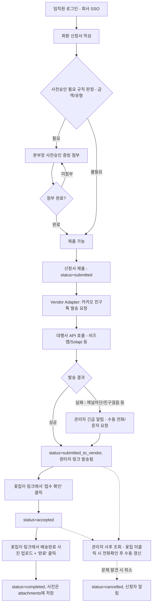
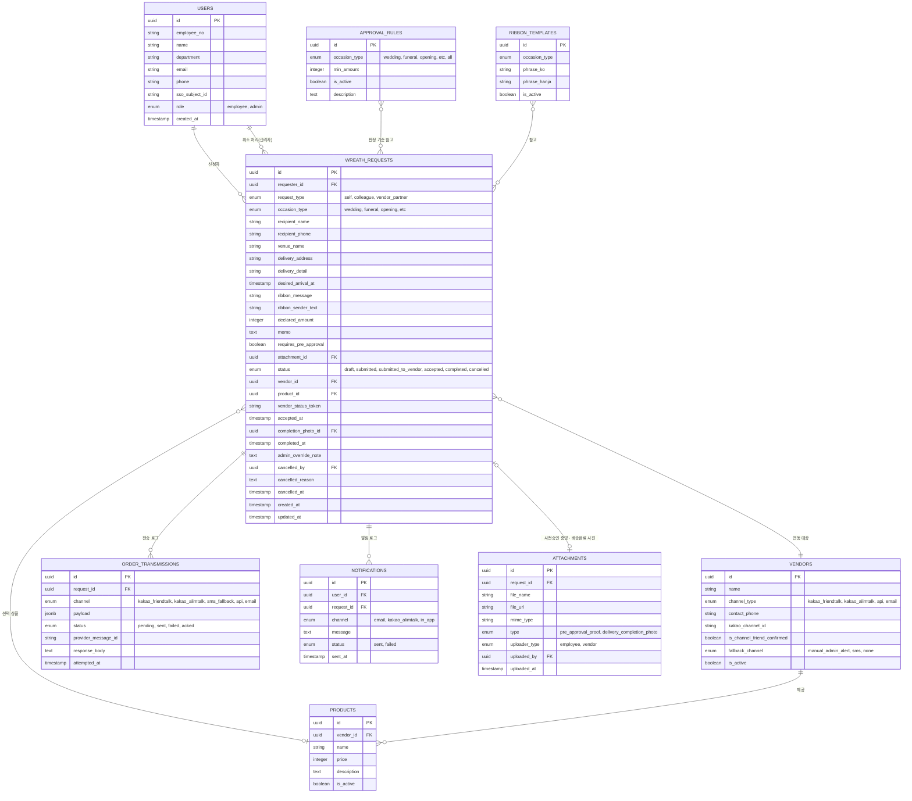

# 사내 경조사 화환 자동 발송 앱 — 1단계: 시스템 아키텍처 & DB 설계

> 확정된 전제: 회사 SSO 연동 로그인 / **관리자(총무·HR) 사전 승인 없이 즉시 꽃집 전달** / 금액·유형 기준 규칙에 해당하면 본부장 사전승인 증빙 첨부 필수 / 관리자는 사후 취소·반려 가능 / 계약 꽃집 1곳 / **꽃집 전달은 회사 카카오톡 비즈니스 채널의 친구톡으로 발송** (꽃집이 계약 관계로 채널 친구 추가) / 반응형 웹 우선 개발

---

## 1. 시스템 아키텍처

### 1-1. 컴포넌트 구성

| 컴포넌트 | 역할 | 제안 기술 |
|---|---|---|
| Client | 신청/조회/증빙 첨부/관리자 사후 관리 화면 (반응형 웹) | Next.js (React) |
| Auth | 회사 SSO 인증 연동 | OIDC/SAML 어댑터 (IdP는 추후 확정 필요) |
| API Server | 비즈니스 로직, 상태 관리 | NestJS 또는 FastAPI |
| Database | 신청/승인/이력 저장 | PostgreSQL |
| Vendor Adapter | 꽃집으로 주문 전달 — **회사 카카오톡 비즈니스 채널의 친구톡**으로 발송 | 카카오 친구톡 발송 대행사(비즈엠/Solapi/NHN Cloud 등) API 연동 |
| Vendor Status Page | 꽃집이 로그인 없이 원터치로 접수/배송중/완료를 직접 표시하는 공개 웹페이지 | Next.js 공개 라우트 (`/vendor/status/[token]`) |
| Notification | 신청자에게 상태 알림 (제출 완료/접수/배송중/완료/취소), 발송 실패 시 관리자 긴급 알림 | 동일 카카오 비즈니스 채널 (또는 Email 병행) |

꽃집이 계약 관계로 회사 채널을 친구 추가할 수 있어, 연동 채널을 **친구톡**으로 확정했습니다. 친구톡은 알림톡과 달리 사전 템플릿 심사 없이 자유로운 형식(이미지 포함)으로 발송할 수 있다는 장점이 있습니다. 다만 카카오는 이 발송 API도 직접 제공하지 않고 비즈엠/Solapi/NHN Cloud 등 인증 대행사(CPaaS)를 통해야 하는 건 동일합니다. **Vendor Adapter 인터페이스는 유지**한 채로 구현체를 "카카오 친구톡 어댑터"로 두었으므로, 나중에 대행사를 바꾸거나 다른 채널이 필요해져도 구현체만 교체하면 됩니다.

> **남아있는 리스크와 보완 설계**: 친구톡은 꽃집이 채널을 차단하거나 친구를 끊으면 카카오 정책상 **자동 SMS 대체발송이 되지 않고 조용히 실패**합니다(알림톡과의 핵심 차이). 이를 그대로 두면 시간이 중요한 화환 주문이 전달되지 않을 위험이 있으므로, 아래와 같은 보완 장치를 설계에 포함했습니다.
> 1. `order_transmissions.status`가 `failed`가 되는 즉시, 관리자에게 **즉시(in-app + email/SMS) 알림**을 발생시켜 수동으로 전화·문자 등으로 직접 전달하도록 합니다 (`vendors.fallback_channel = manual_admin_alert`).
> 2. 일부 CPaaS 대행사는 발송 전 "채널 차단/친구 상태" 사전 조회 API를 제공합니다 — 대행사 선정 시 이 기능 지원 여부를 확인하면 실패를 사전에 감지할 수 있습니다.
> 3. 온보딩 체크리스트에 "꽃집 사장님의 채널 친구 추가 여부 확인"을 정기적으로 재확인하는 절차를 추가하는 것을 권장합니다.

> **배송 상태를 어떻게 아는가**: 친구톡은 우리 → 꽃집으로 가는 일방향 메시지라, 꽃집이 자체 주문 시스템으로 API 응답을 주지 않는 한 "접수/배송중/완료"를 시스템이 스스로 알 방법이 없습니다. 이를 해결하기 위해 신청 1건마다 고유 토큰을 발급하고, 친구톡 메시지 안에 그 토큰이 담긴 **로그인 없는 원터치 링크**(`/vendor/status/{token}`)를 버튼으로 넣습니다. 꽃집 사장님은 이 링크에 들어가 그 시점에 가능한 다음 단계 버튼(예: "접수 확인" → 나중에 "배송 완료")만 눌러 상태를 직접 갱신합니다. 꽃집이 링크를 누르지 않는 경우를 대비해, 관리자가 전화로 확인 후 수동으로 상태를 갱신할 수 있는 기능(2단계의 `/api/admin/wreath-requests/{id}/delivery-status`)은 안전망으로 계속 유지합니다. 세부 구현은 4단계에서 다룹니다.

### 1-2. 전체 흐름도

관리자 승인 단계를 없애고, 신청서 작성 과정에서 규칙에 해당하면 증빙 첨부를 제출의 전제조건으로 두는 방식입니다. 관리자는 승인자가 아니라 **사후 모니터링/취소 권한을 가진 감사자** 역할로 바뀝니다.

### 1-3. 상태(Status) 정의

신청 1건은 다음 상태를 순서대로 이동합니다 (취소 제외):

`draft → submitted → submitted_to_vendor → accepted → completed`

- `cancelled`는 종단 상태로, 관리자가 제출 이후 어느 시점에서든(완료 전) 사후에 취소할 때 사용합니다. 승인 게이트가 아니라 **사후 개입 수단**이라는 점이 이전 설계와의 핵심 차이입니다.
- 관리자 승인 단계가 사라졌으므로, `submitted` 상태가 되는 즉시(=제출 즉시) `submitted_to_vendor`로 넘어가는 Vendor Adapter 호출이 트리거됩니다. 규칙상 사전승인 증빙이 필요한 신청은 첨부가 없으면 애초에 `submitted` 상태로 전환(제출)되지 않도록 폼/API 양쪽에서 막습니다.
- `accepted`와 `completed`는 관리자나 시스템이 아니라 **꽃집이 원터치 링크에서 직접 눌러야만** 바뀌는 상태입니다. `accepted`는 "접수 확인" 클릭, `completed`는 배송완료 사진을 첨부하고 "완료" 클릭입니다. 별도의 "배송중" 상태는 두지 않았습니다 — 꽃집이 그 시점을 따로 알려줄 유인이 적어 클릭을 하나 더 요구하는 대신, `accepted` 이후 아직 `completed`가 아니면 화면에서는 "배송 준비/진행 중"으로 자연스럽게 보여주는 방식을 택했습니다.
- 꽃집이 링크를 전혀 누르지 않는 경우를 대비해, 관리자가 전화로 확인 후 `accepted`/`completed`를 대신 수동으로 바꿔줄 수 있는 기능은 안전망으로 유지합니다.

---

## 2. 데이터베이스 설계 (ERD)

### 2-1. 테이블별 설계 의도

- **users**: SSO 로그인 후 발급되는 `sso_subject_id`로 계정을 매핑합니다. 승인 게이트가 없어졌으므로 `role`은 `employee`/`admin` 두 가지만 두었고, `admin`은 승인자가 아니라 사후 조회·취소 권한을 가진 역할입니다.
- **wreath_requests**: 핵심 트랜잭션 테이블. `vendor_id`, `product_id`는 현재 꽃집이 1곳뿐이라 사실상 고정값이지만, FK로 정규화해두면 이후 꽃집이 추가되거나 상품이 세분화돼도 스키마 변경이 필요 없습니다. `requires_pre_approval`은 제출 시점의 `approval_rules` 판정 결과를 스냅샷으로 저장합니다 — 이후 규칙이 바뀌어도 이미 제출된 신청의 판정 근거가 바뀌지 않도록 하기 위함입니다. `attachment_id`는 `requires_pre_approval=true`인 경우 앱/API 양쪽에서 NULL이면 제출을 막습니다. `vendor_status_token`은 꽃집에게 보내는 원터치 링크(`/vendor/status/{token}`)의 인증 수단으로 쓰이는, 신청 1건당 발급되는 추측 불가능한 랜덤 문자열입니다. `completion_photo_id`는 꽃집이 그 링크에서 올린 배송완료 사진을 가리키는 FK입니다. `admin_override_note`는 꽃집이 링크를 누르지 않아 관리자가 전화 확인 후 수동으로 상태를 바꾼 경우(사진 없이 완료 처리되는 경우 등) 그 경위를 남기는 필드입니다(4단계 참고). `cancelled_by/cancelled_reason/cancelled_at`은 관리자의 사후 취소 처리를 기록합니다.
- **attachments**: 본부장 사전승인 증빙과 꽃집의 배송완료 사진을 함께 저장하는 테이블입니다. 두 파일은 업로드하는 주체가 다르므로(`uploader_type = employee` vs `vendor`) 구분해두었고, 사전승인 증빙은 SSO 인증을 마친 직원이 업로드하지만 배송완료 사진은 로그인 없는 `vendor_status_token` 링크를 통해 업로드된다는 점에서 인증 방식 자체가 다릅니다. 신청 1건에 필요한 파일이 각각 보통 1개이므로 1:1에 가깝게 설계했지만, 추후 여러 장 첨부가 필요해지면 1:N으로 쉽게 확장할 수 있는 구조입니다.
- **approval_rules**: "어떤 경우에 사전승인 증빙이 필요한가"를 코드 변경 없이 총무/HR이 직접 조정할 수 있게 하는 정책 테이블입니다. 예: 결혼(wedding) 유형은 declared_amount가 300,000원을 넘으면 필요, 거래처(vendor_partner) 신청은 금액 무관 항상 필요 등 — 실제 임계값과 대상 유형은 확정이 필요합니다(3장 참고).
- **vendors / products**: 지금은 1행짜리 테이블이지만, `channel_type`을 `kakao_friendtalk`로 고정해도 카카오 채널ID·수신 전화번호를 컬럼으로 정규화해두면 Vendor Adapter가 이 값을 읽어 발송 API 호출 파라미터를 구성할 수 있습니다. `is_channel_friend_confirmed`는 온보딩 시 꽃집이 실제로 채널 친구 추가를 완료했는지 체크하는 플래그입니다. `fallback_channel`은 친구톡 발송이 실패했을 때의 대응 방식을 정하는데, 친구톡은 자동 SMS 대체발송이 되지 않으므로 기본값은 `manual_admin_alert`(관리자에게 즉시 알려 수동으로 연락)로 설정했습니다.
- **order_transmissions**: 꽃집에 실제로 보낸 payload와 응답/실패 로그를 별도로 남겨, 전송 실패 시 재시도나 장애 추적이 가능하도록 했습니다. `provider_message_id`는 알림톡 대행사가 발급하는 메시지 ID로, 이후 발송 결과 콜백/웹훅이 오면 이 ID로 어떤 신청의 전송인지 매칭합니다. `wreath_requests.status`와 분리한 이유는, 상태값은 "신청의 현재 단계"이고 이 테이블은 "그 단계로 넘어가기 위해 실제로 벌어진 통신 시도"라서 책임을 나누는 게 디버깅에 유리하기 때문입니다.
- **notifications**: 신청자에게 보낸 상태 알림(승인됨/반려됨/배송중 등) 로그.
- **ribbon_templates**: 결혼/부고 등 경조사 유형별로 자주 쓰는 문구(祝 結婚, 謹弔 등)를 미리 등록해두고 선택하거나 직접 입력할 수 있게 하는 참조 테이블입니다.

---

## 3. 설계 시 남겨둔 확인 필요 사항

다음 항목은 이번 아키텍처/스키마에는 일단 유연하게 대응 가능하도록 설계해두었지만, 실제 구현 전에 확정이 필요합니다.

1. **SSO 공급자**: Azure AD / Google Workspace / 자체 IdP 중 무엇인지에 따라 OIDC 클라이언트 설정이 달라집니다.
2. **친구톡 발송 대행사 선정**: 카카오는 친구톡 API도 직접 제공하지 않으므로 비즈엠/Solapi/NHN Cloud 등 대행사 중 하나와 계약이 필요합니다. 가능하면 발송 전 "채널 차단/친구 상태" 사전 조회 기능을 지원하는 대행사를 우선 검토하는 것을 권장합니다.
3. **꽃집의 채널 친구 추가 온보딩**: 실제로 꽃집 사장님이 회사 채널을 친구 추가했는지 개발 전에 확인하고, 이후에도 정기적으로 재확인할 절차가 필요합니다.
4. **발송 실패 시 관리자 알림 방식 확정**: 친구톡 실패(채널 차단/친구 끊음 등) 시 관리자에게 in-app/이메일/SMS 중 어떤 방식으로, 얼마나 빠르게 알릴지 확정이 필요합니다.
5. **사전승인 판정 기준값**: `approval_rules`에 실제로 넣을 값 — 어떤 경조사 유형에, 어떤 금액 이상일 때 본부장 사전승인 증빙을 요구할지 구체적인 기준이 필요합니다. (예: 전 유형 공통 금액 기준 하나만 둘지, 유형별로 다르게 둘지)
6. **개인정보 처리**: 부고/결혼 등 민감한 개인정보가 포함되므로, 데이터 보관 기간 및 접근 권한 정책은 별도로 정리가 필요합니다 (스키마상 `soft delete`/보관기간 컬럼 추가 여부 검토).
7. **원터치 링크 토큰 정책**: `vendor_status_token`이 유출되면 제3자가 해당 신청의 상태를 조작할 수 있으므로, 토큰 길이/만료 시점(예: 완료 처리 후 즉시 만료)을 정해야 합니다. 4단계에서 구체적인 생성·검증 로직을 다룹니다.

---

*다음 단계: 2단계 — 핵심 API 엔드포인트 명세 (신청 생성/조회, 승인, 상태 업데이트 등)*
