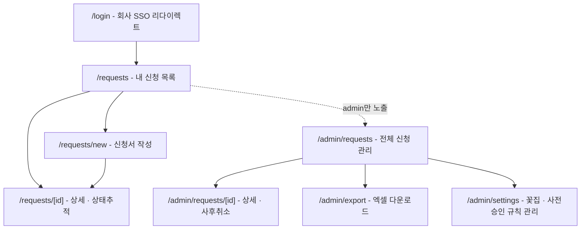

# 사내 경조사 화환 자동 발송 앱 — 3단계: 프론트엔드 와이어프레임 & 폼 컴포넌트

> 1~2단계 전제 반영: 승인 대기 없음 / 규칙 기반 사전승인 증빙 조건부 필수 / 제출 전(꽃집 전달 전)까지만 자진 취소 가능 / 관리자는 사후 취소 + 엑셀 추출 / 배송 상태는 꽃집이 원터치 링크로 직접 갱신(`accepted`/`completed`, "배송중"은 별도 DB 상태 없이 화면에서만 표시) / Next.js 반응형 웹. 꽃집이 접속하는 원터치 링크 페이지 자체는 이 앱과 별도의 공개 화면으로, 4단계에서 다룹니다.

---

## 1. 사이트 맵 (라우팅 구조)



일반 임직원은 `/requests*` 경로만 보이고, `admin` 역할 사용자는 상단 네비게이션에 "관리자" 메뉴가 추가로 노출되어 `/admin/*`로 이동합니다.

---

## 2. 화면별 와이어프레임 구조

### 2-1. 내 신청 목록 (`/requests`)

```
┌────────────────────────────────────────────┐
│  경조사 화환 신청 내역          [+ 새 신청]  │
├────────────────────────────────────────────┤
│  신청일       유형     수령인   상태         │
│  08/26      결혼(본인)  홍길동  ● 배송중     │
│  08/20      부고(동료)  김철수  ● 완료       │
│  08/15      결혼(거래처) 이영희 ● 취소됨     │
│  ...                              [상세 >]  │
└────────────────────────────────────────────┘
```

상태 배지 색상: `submitted`/`submitted_to_vendor`=회색("신청완료"로 통합 표시), `accepted`=주황("배송중"으로 표시), `completed`=초록, `cancelled`=빨강. "배송중"은 `accepted`이지만 아직 `completed`가 아닌 상태를 화면에서 부르는 이름일 뿐, DB에 별도로 존재하는 상태는 아닙니다. 모바일 화면에서는 표 대신 카드형 리스트로 전환합니다.

### 2-2. 신청서 작성 (`/requests/new`) — 핵심 화면

승인 대기 단계가 없으므로 위저드(여러 단계) 대신 **한 페이지 스크롤 폼**으로 구성해 제출까지의 마찰을 최소화합니다. 다만 "사전승인 증빙" 섹션은 조건에 해당할 때만 나타나는 동적 섹션입니다.

```
┌────────────────────────────────────────────┐
│ A. 신청 유형                                │
│   ( ) 본인/가족   ( ) 동료   ( ) 거래처      │
│   경조사 유형: [ 결혼 ▾ ]                    │
├────────────────────────────────────────────┤
│ B. 수령/배송 정보                           │
│   수령인 이름 [______]  연락처 [______]      │
│   장소명(예식장/장례식장) [______________]   │
│   상세주소 [_____________________]         │
│   도착 희망 일시 [ 2026-09-05  09:00 ▾ ]     │
├────────────────────────────────────────────┤
│ C. 상품 및 금액                             │
│   상품 선택 [ 프리미엄 화환 (150,000원) ▾ ]  │
│                                              │
│  ┌ (declaredAmount ≥ 규칙 기준일 때만 노출) ┐│
│  │ ⚠ 본부장 사전승인이 필요한 신청입니다.    ││
│  │   승인 증빙 파일을 첨부해주세요.          ││
│  │   [ 파일 선택 ]  승인서.pdf ✓            ││
│  └──────────────────────────────────────────┘│
├────────────────────────────────────────────┤
│ D. 리본 문구                                │
│   경조사어 [ 祝 結婚 ▾ ] 또는 [직접 입력]     │
│   보내는 이 [ 경영지원팀 김철수 ]            │
├────────────────────────────────────────────┤
│ E. 기타 요청사항                            │
│   [ 메모 텍스트영역                    ]    │
├────────────────────────────────────────────┤
│                      [취소]  [제출하기]      │
└────────────────────────────────────────────┘
```

동작 방식: `occasionType`이나 `declaredAmount`가 바뀔 때마다(디바운스 500ms) `GET /api/approval-rules/check`를 호출해 사전승인 필요 여부를 실시간으로 판정합니다. 필요한 경우 첨부 섹션이 나타나고, 파일이 없으면 "제출하기" 버튼이 비활성화됩니다. 다만 최종 검증은 항상 서버(제출 시 422)가 다시 하므로, 이 실시간 체크는 UX 개선용이고 보안/무결성의 근거는 아닙니다.

### 2-3. 상세 · 상태추적 (`/requests/[id]`)

```
┌────────────────────────────────────────────┐
│  신청 상세                                  │
│                                              │
│  ● ── ● ── ○ ── ○                          │
│ 제출완료  꽃집접수  배송중   완료             │
│                                              │
│  경조사 유형: 결혼(본인)                     │
│  수령인: 홍길동 / 010-1234-5678              │
│  장소: OO웨딩홀 3층 그랜드홀                 │
│  도착 희망: 2026-09-05 09:00                │
│  리본 문구: 祝 結婚 / 경영지원팀 김철수       │
│                                              │
│  [ 신청 취소 ]  ← status=submitted일 때만 노출│
│                                              │
│  ┌ (status=completed일 때만 노출) ──────────┐│
│  │ 📷 배송완료 사진        [썸네일 이미지]    ││
│  └──────────────────────────────────────────┘│
└────────────────────────────────────────────┘
```

`status=submitted`일 때만 "신청 취소" 버튼이 보이고, `submitted_to_vendor`로 넘어간 순간부터는 버튼이 사라지며 "이미 꽃집에 전달되어 취소할 수 없습니다. 변경이 필요하면 총무팀에 문의해주세요" 안내 문구로 대체됩니다. `cancelled` 상태인 경우 스테퍼 대신 취소 사유가 표시됩니다. `completed`가 되면 꽃집이 원터치 링크에서 올린 배송완료 사진이 함께 표시되는데, 이 사진은 신청자가 직접 올리는 게 아니라 꽃집이 링크 페이지에서 첨부한 것이 그대로 내려오는 것입니다 — 관리자가 수동으로 완료 처리한 경우에는 사진 없이 "사진 없음(관리자 수동 처리)"로 표시됩니다.

### 2-4. 관리자 전체 신청 관리 (`/admin/requests`)

```
┌────────────────────────────────────────────┐
│  전체 신청 관리        [기간▾][부서▾][상태▾]│
│                                [⬇ 엑셀 다운로드]│
├────────────────────────────────────────────┤
│ 신청자  부서   유형   사전승인  상태   관리   │
│ 홍길동  영업1팀 결혼   불필요   배송중 [상세] │
│ 김철수  총무팀  부고   불필요   완료   [상세] │
│ 이영희  기획팀  결혼   ✓첨부됨  배송중 [상세] │
└────────────────────────────────────────────┘
```

### 2-5. 관리자 상세 (`/admin/requests/[id]`)

신청 상세 정보에 더해 증빙 파일 링크(있는 경우), 친구톡 발송 로그(`order_transmissions`의 성공/실패 이력)를 함께 보여주고, `completed`가 아닌 신청에는 "취소" 버튼과 사유 입력 모달을 제공합니다.

---

## 3. 핵심 폼 컴포넌트 예시 코드

React + Next.js(App Router) + `react-hook-form` + `zod` 기준입니다. 실제 프로젝트의 디자인 시스템(예: shadcn/ui 등)에 맞춰 마크업은 조정이 필요합니다.

### 3-1. 사전승인 필요 여부 실시간 체크 훅

```tsx
// hooks/useApprovalRuleCheck.ts
import { useEffect, useState } from "react";

export function useApprovalRuleCheck(occasionType: string, declaredAmount: number) {
  const [requiresPreApproval, setRequiresPreApproval] = useState(false);
  const [loading, setLoading] = useState(false);

  useEffect(() => {
    if (!occasionType || !declaredAmount) return;
    const timer = setTimeout(async () => {
      setLoading(true);
      try {
        const res = await fetch(
          `/api/approval-rules/check?occasionType=${occasionType}&declaredAmount=${declaredAmount}`
        );
        const json = await res.json();
        setRequiresPreApproval(json.data.requiresPreApproval);
      } finally {
        setLoading(false);
      }
    }, 500); // 디바운스
    return () => clearTimeout(timer);
  }, [occasionType, declaredAmount]);

  return { requiresPreApproval, loading };
}
```

### 3-2. 증빙 첨부 업로더

```tsx
// components/AttachmentUploader.tsx
"use client";
import { useState } from "react";

export function AttachmentUploader({
  onUploaded,
}: {
  onUploaded: (attachmentId: string, fileName: string) => void;
}) {
  const [fileName, setFileName] = useState<string | null>(null);
  const [uploading, setUploading] = useState(false);

  async function handleChange(e: React.ChangeEvent<HTMLInputElement>) {
    const file = e.target.files?.[0];
    if (!file) return;
    setUploading(true);
    const formData = new FormData();
    formData.append("file", file);

    const res = await fetch("/api/attachments", { method: "POST", body: formData });
    const json = await res.json();
    setFileName(file.name);
    setUploading(false);
    onUploaded(json.data.attachmentId, file.name);
  }

  return (
    <div className="border rounded-md p-3 bg-amber-50">
      <p className="text-sm font-medium text-amber-800">
        ⚠ 본부장 사전승인이 필요한 신청입니다. 승인 증빙을 첨부해주세요.
      </p>
      <input type="file" accept=".pdf,.jpg,.png" onChange={handleChange} disabled={uploading} />
      {fileName && <p className="text-sm text-green-700">첨부됨: {fileName} ✓</p>}
    </div>
  );
}
```

### 3-3. 신청서 폼 (핵심 컴포넌트, 골격만)

```tsx
// app/requests/new/page.tsx
"use client";
import { useForm } from "react-hook-form";
import { zodResolver } from "@hookform/resolvers/zod";
import { z } from "zod";
import { useState } from "react";
import { useApprovalRuleCheck } from "@/hooks/useApprovalRuleCheck";
import { AttachmentUploader } from "@/components/AttachmentUploader";

const schema = z.object({
  requestType: z.enum(["self", "colleague", "vendor_partner"]),
  occasionType: z.enum(["wedding", "funeral", "opening", "etc"]),
  recipientName: z.string().min(1),
  recipientPhone: z.string().min(9),
  venueName: z.string().min(1),
  deliveryAddress: z.string().min(1),
  deliveryDetail: z.string().optional(),
  desiredArrivalAt: z.string(),
  productId: z.string().uuid(),
  declaredAmount: z.coerce.number().positive(),
  ribbonMessage: z.string().min(1),
  ribbonSenderText: z.string().min(1),
  memo: z.string().optional(),
});

export default function NewWreathRequestPage() {
  const { register, handleSubmit, watch, formState } = useForm({
    resolver: zodResolver(schema),
  });
  const [attachmentId, setAttachmentId] = useState<string | null>(null);
  const [submitError, setSubmitError] = useState<string | null>(null);

  const occasionType = watch("occasionType");
  const declaredAmount = watch("declaredAmount");
  const { requiresPreApproval } = useApprovalRuleCheck(occasionType, declaredAmount);

  const canSubmit = !requiresPreApproval || !!attachmentId;

  async function onSubmit(values: z.infer<typeof schema>) {
    setSubmitError(null);
    const res = await fetch("/api/wreath-requests", {
      method: "POST",
      headers: { "Content-Type": "application/json" },
      body: JSON.stringify({ ...values, attachmentId }),
    });

    if (res.status === 422) {
      const json = await res.json();
      setSubmitError(json.error.message); // "본부장 사전승인 증빙 첨부가 필요합니다" 등
      return;
    }
    const json = await res.json();
    window.location.href = `/requests/${json.data.id}`;
  }

  return (
    <form onSubmit={handleSubmit(onSubmit)} className="space-y-6 max-w-xl mx-auto">
      {/* A. 신청 유형 / B. 수령·배송 정보 / C. 상품·금액 입력 필드는
          register()로 각 <input>, <select>에 연결 (지면상 생략) */}

      {requiresPreApproval && (
        <AttachmentUploader
          onUploaded={(id) => setAttachmentId(id)}
        />
      )}

      {submitError && <p className="text-red-600 text-sm">{submitError}</p>}

      <button type="submit" disabled={!canSubmit || formState.isSubmitting}>
        제출하기
      </button>
    </form>
  );
}
```

### 3-4. 상태 스테퍼 컴포넌트

```tsx
// components/StatusTracker.tsx
// DB status는 submitted/submitted_to_vendor/accepted/completed 4가지뿐이지만,
// 화면에는 "신청 완료 → 꽃집 접수 → 배송 중 → 완료" 4단계로 보여준다.
// submitted·submitted_to_vendor는 1번째 단계로 합치고, accepted는 2·3번째 단계 사이(배송 중)로 취급한다.
const STEPS = [
  { key: "submitted", label: "신청 완료" },
  { key: "accepted", label: "꽃집 접수" },
  { key: "accepted_in_progress", label: "배송 중" }, // 실제 status는 accepted와 동일, 화면 표시용 가짜 단계
  { key: "completed", label: "완료" },
] as const;

function toDisplayStep(status: string) {
  if (status === "submitted" || status === "submitted_to_vendor") return "submitted";
  if (status === "completed") return "completed";
  if (status === "accepted") return "accepted"; // 접수 직후에는 2번째 단계에만 점이 찍힘
  return status;
}

export function StatusTracker({ status }: { status: string }) {
  if (status === "cancelled") {
    return <p className="text-red-600 font-medium">이 신청은 취소되었습니다.</p>;
  }
  const displayStep = toDisplayStep(status);
  // "배송 중" 칸은 accepted가 어느 정도 시간이 지나도 completed가 아니면 채워지는 것으로 보여주기 위한
  // 화면 전용 처리이며, 실제로는 accepted와 동일한 상태다.
  const currentIndex =
    displayStep === "accepted"
      ? 2 // 접수 완료 후에는 "배송 중"까지 채워진 것으로 보여준다
      : STEPS.findIndex((s) => s.key === displayStep);

  return (
    <div className="flex items-center">
      {STEPS.map((step, i) => (
        <div key={step.key} className="flex items-center">
          <div
            className={`w-3 h-3 rounded-full ${
              i <= currentIndex ? "bg-blue-600" : "bg-gray-300"
            }`}
          />
          <span className="ml-1 mr-3 text-sm">{step.label}</span>
          {i < STEPS.length - 1 && <div className="w-8 h-px bg-gray-300 mr-3" />}
        </div>
      ))}
    </div>
  );
}
```

### 3-5. 신청 취소 버튼 (상세 화면 일부)

```tsx
// 상세 화면 내 취소 버튼 — status=submitted일 때만 렌더링
{status === "submitted" && (
  <button
    onClick={async () => {
      if (!confirm("신청을 취소하시겠습니까?")) return;
      const res = await fetch(`/api/wreath-requests/${id}/cancel`, { method: "POST" });
      if (res.status === 409) {
        alert("이미 꽃집에 전달되어 취소할 수 없습니다. 총무팀에 문의해주세요.");
        return;
      }
      location.reload();
    }}
  >
    신청 취소
  </button>
)}
```

---

## 4. 확인 필요 사항

1. **디자인 시스템 선택**: 위 예시는 Tailwind 유틸리티 클래스 기준으로 작성했습니다. shadcn/ui, MUI 등 구체적인 컴포넌트 라이브러리를 쓸지 정하면 실제 마크업을 더 다듬을 수 있습니다.
2. **증빙 파일 제약**: 업로드 가능한 파일 형식(PDF/이미지)과 용량 제한을 정책으로 정해야 클라이언트/서버 양쪽에 검증 로직을 넣을 수 있습니다.
3. **모바일 대응 범위**: 반응형 웹이 기본이지만, 목록 화면을 표 대신 카드형으로 바꾸는 브레이크포인트 등 세부 디자인은 실제 디자이너/기획 검토가 필요합니다.

---

*다음 단계: 4단계 — 꽃집(카카오 친구톡)에 주문 정보를 전송하는 백엔드 연동 로직 샘플 코드*
